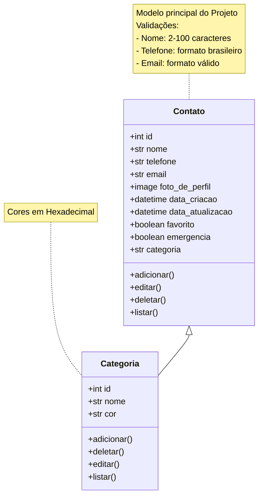

# Lista-Fone

Sistema de Lista Telefônica visando abranger as principais funcionalidades do CRUD (Create, Read, Update, Delete) de contatos telefônicos.

## Funcionalidades: Análise de Requisitos

### Requisitos Funcionais:

- **RF01**: Criar contatos;
- **RF02**: Deletar contatos;
- **RF03**: Alterar contatos;
- **RF04**: Listar contatos de forma total;
- **RF05**: Filtro de contatos;
- **RF06**: Validação de telefones;

### Requisitos Não Funcionais:

- **RNF01**: Backup de contatos;
- **RNF02**: Categorias/grupos de contatos;
- **RNF03**: Campo de e-mail para enviar e-mails ao usuário;
- **RNF04**: Compartilhamento de contato (arquivo .vcard);
- **RNF05**: Foto de Perfil dos Contatos;
- **RNF06**: Contador de contatos;
- **RNF07**: Contatos mais acessados;
- **RNF08**: Contatos de emergência;
- **RNF09**: Perfil de usuário;
- **RNF10**: Contatos favoritos;

## Modelagem de Dados

## Wireframes

Tela principal:

 